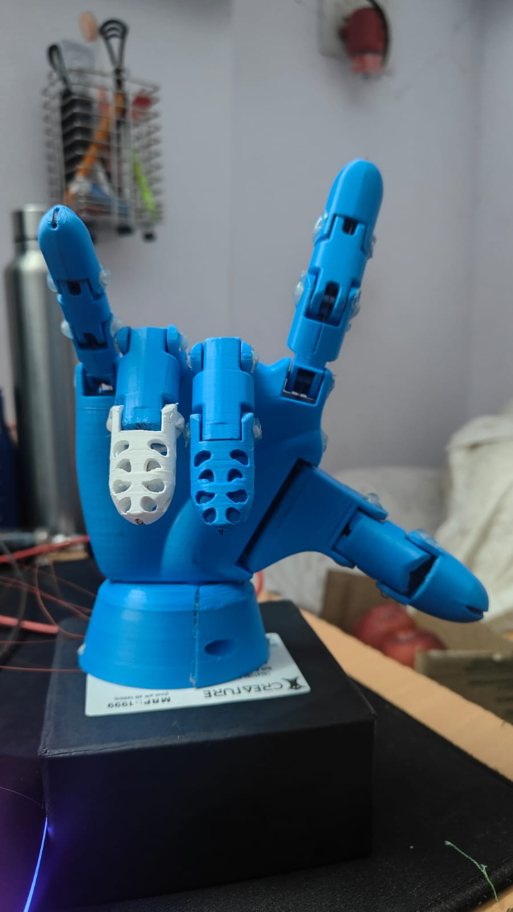

# REARM: Robotic Enhancement and Assistive Rehabilitation Mechanism

REARM is a low-cost, 3D-printed prosthetic hand system controlled via a custom-designed flex sensor glove and webcam-based computer vision. By combining additive manufacturing, sensor integration, and intelligent control algorithms, REARM provides a highly functional, affordable, and accessible alternative to traditional high-cost myoelectric prosthetics.

This project was developed as a **first-semester college engineering project** at the **Vishwakarma Institute of Technology, Pune**.

---

## 👥 Authors & Team
* **Department of Engineering, Sciences and Humanities (DESH)**
* **Vishwakarma Institute of Technology (VIT), Pune, Maharashtra, India**

**Team Members:**
* Chandrashekhar Mahajan
* Prathamesh Katole
* Pranav Khandelwal
* Prathmesh Mante
* Pranjal Singh
* Prathmesh Lathkar

---

## 🖼️ Prototype & Demo

Here is a visual demonstration of the REARM prototype:

### Prototype Device


### System Demonstration Video
🎥 **[Watch the Demo Video](assets/demo_video.mp4)** (Double-click or open in a media player to watch the execution demo).

---

## ⚡ Key Features
1. **Tendon-Driven Prosthetic Hand:** Uses 5 micro-servos pulling synthetic tendons to simulate natural human finger bending (flexion) and extension.
2. **Dual-Control System:**
   * **Computer Vision (CV) Mode:** Uses MediaPipe & OpenCV to track hand landmarks from a standard webcam and instantly mirror movements to the robotic hand (no hardware glove needed).
   * **Manual Control:** A premium, modern GUI built with CustomTkinter that offers sliders, segmented button overrides, and quick-presets (Fist, Open, Point, Peace, Okay) for easy configuration.
   * **AI Mode (Under Development):** A gesture classification pipeline designed to recognize rolling buffers of sensor data using Machine Learning (SVM/Random Forests) and execute multi-step macros via a Finite State Machine.
3. **Microcontroller Serial Communication:** A robust serial interface operating at 115200 baud rate that allows Python to transmit real-time finger states to the Arduino microcontroller.

---

## 📊 System Architecture & Modes

The project operates under two primary controller schemas:

### CV Mode vs. AI Mode Comparison

| Feature / Aspect | CV Mode (`hand_track.py`) | AI Mode (`ai_mode.py` - Drafted) |
| :--- | :--- | :--- |
| **Classification** | Rule-based finger position checking | ML-ready feature extraction + confidence scoring |
| **Output** | Direct finger states (0: Closed, 1: Half, 2: Open) | Gesture labels (GRIP, RELEASE, etc.) with probabilities |
| **Confidence** | None | Threshold-based action gating (65% default) |
| **Motion Response** | Fixed speed | Adaptive speed (0.2-1.0) based on stability |
| **Action Mapping** | 1:1 finger → servo | Sequences via Finite State Machine |
| **Interruptibility** | Limited | Full STOP signal halts mid-sequence |

### AI Mode Pipeline Architecture Diagram

```
┌─────────────────────────────────────────────────────────────────────────────┐
│                            AI MODE ARCHITECTURE                              │
├─────────────────────────────────────────────────────────────────────────────┤
│                                                                              │
│  ┌──────────────┐    ┌──────────────────┐    ┌──────────────────────────┐   │
│  │   WEBCAM     │───▶│  HAND DETECTOR   │───▶│   FEATURE EXTRACTOR      │   │
│  │   INPUT      │    │  (MediaPipe)     │    │   (21 landmarks → 15     │   │
│  └──────────────┘    └──────────────────┘    │    engineered features)  │   │
│                                               └───────────┬──────────────┘   │
│                                                           │                  │
│                                                           ▼                  │
│  ┌──────────────┐    ┌──────────────────┐    ┌──────────────────────────┐   │
│  │   MOTION     │◀───│  LANDMARK        │    │   GESTURE CLASSIFIER     │   │
│  │   ANALYZER   │    │  HISTORY         │    │   (SVM/Random Forest)    │   │
│  │              │    │  (Rolling Buffer)│    │   + Confidence Score     │   │
│  └──────┬───────┘    └──────────────────┘    └───────────┬──────────────┘   │
│         │                                                 │                  │
│         ▼                                                 ▼                  │
│  ┌──────────────┐                            ┌──────────────────────────┐   │
│  │   SPEED      │                            │   ACTION SEQUENCER       │   │
│  │   CONTROLLER │───────────────────────────▶│   (Finite State Machine) │   │
│  │   (0.2-1.0)  │                            │                          │   │
│  └──────────────┘                            └───────────┬──────────────┘   │
│                                                           │                  │
│         ┌─────────────────────────────────────────────────┘                  │
│         ▼                                                                    │
│  ┌──────────────────────────────────────────────────────────────────────┐   │
│  │                     SERVO COMMAND EXECUTOR                            │   │
│  │              (Applies speed factor, sends to Arduino)                 │   │
│  └──────────────────────────────────────────────────────────────────────┘   │
│                                                                              │
│  ┌──────────────────────────────────────────────────────────────────────┐   │
│  │                         STOP SIGNAL HANDLER                           │   │
│  │         (Thread-safe interrupt, halts all components instantly)       │   │
│  └──────────────────────────────────────────────────────────────────────┘   │
└─────────────────────────────────────────────────────────────────────────────┘
```

---

## 📂 Repository Structure

The project has been organized for ease of navigation and clean deployment on GitHub:

```
REARM/
├── arduino/
│   └── rearm_controller/
│       └── rearm_controller.ino  # Arduino controller sketch for servo actuation
├── assets/
│   ├── prototype_image.jpeg      # Photo of the built robotic hand
│   └── demo_video.mp4            # Video of the system in action
├── docs/
│   └── REARM_Research_Paper.docx # College research paper detailing methodology
├── src/
│   ├── ai_mode.py                # Gesture recognition skeleton
│   ├── arduino_controller.py     # Python Serial communication interface
│   ├── control_hand.py           # GUI application launcher (CustomTkinter)
│   ├── hand_track.py             # OpenCV/MediaPipe Computer Vision engine
│   ├── HandTrackingModule.py     # General MediaPipe wrapper class
│   └── list_cameras.py           # Port diagnostic utility for webcams
├── .gitignore                    # Git file exclusions
├── README.md                     # This file
└── requirements.txt              # Python packages required
```

---

## 🛠️ Hardware Specifications & Connection Map

### 1. Components List
* **Arduino Microcontroller:** Uno, Nano, or Mega.
* **5 Servo Motors:** SG90 micro servos or MG90S metal gear servos (recommended for higher torque).
* **Flex Sensors:** 5 flex sensors (e.g., Spectra Symbol 2.2") mounted on a glove (or webcam replacement in CV mode).
* **Power Supply:** External 5V 2A-3A DC power source for the servos (do not power all 5 servos directly from the Arduino 5V pin, as it will draw too much current and reset the board).
* **Capacitor:** 100uF - 470uF decoupling capacitor across the servo power rail to smooth voltage spikes.

### 2. Arduino Pin Connections

| Finger Servo | Arduino Pin | Default Open Angle | Default Closed Angle |
| :--- | :--- | :--- | :--- |
| **Thumb** | Pin 2 | 170° | 10° |
| **Index** | Pin 3 | 170° | 10° |
| **Middle** | Pin 4 | 170° | 10° |
| **Ring** | Pin 5 | 170° | 10° |
| **Pinky** | Pin 6 | 170° | 10° |

* *Note:* Connect all Servo grounds (`GND`) to the Arduino ground (`GND`).

---

## 💻 Software Installation & Setup

### Prerequisites
* **Python 3.8+** installed on your system.
* **Arduino IDE** for uploading code to the microcontroller.

### Step 1: Install Python Dependencies
Clone this repository, navigate to the project directory, and install requirements:
```bash
pip install -r requirements.txt
```

### Step 2: Upload Arduino Sketch
1. Connect your Arduino to your computer using a USB cable.
2. Open `arduino/rearm_controller/rearm_controller.ino` in the **Arduino IDE**.
3. Select your Board (e.g., *Arduino Uno*) and Port under the `Tools` menu.
4. Click **Upload** (right arrow icon).

---

## 🚀 Running the System

1. Connect the uploaded Arduino to your PC's USB port.
2. Start the primary GUI application from the repository root:
   ```bash
   python src/control_hand.py
   ```
3. **GUI Controls:**
   * **Re-connect:** If the Arduino connection status shows offline (red indicator), click `↻ RECONNECT` to automatically scan and link to the COM/tty port.
   * **Manual Control:** Click `MANUAL CONTROL` to open the sliders page. Test quick presets like `Fist` or `Open`, or toggle each finger status individually using the segment buttons (`Open`, `Half`, `Closed`). Press `SEND COMMAND 📡` to transmit.
   * **Computer Vision:** Click `COMPUTER VISION` to start tracking your right hand. Ensure you use your **right hand** in front of the camera.
     * **Key Bindings in CV Mode:**
       * Press `R` inside the video window to attempt serial reconnect.
       * Press `Q` inside the video window to quit CV mode and return to the main dashboard.
